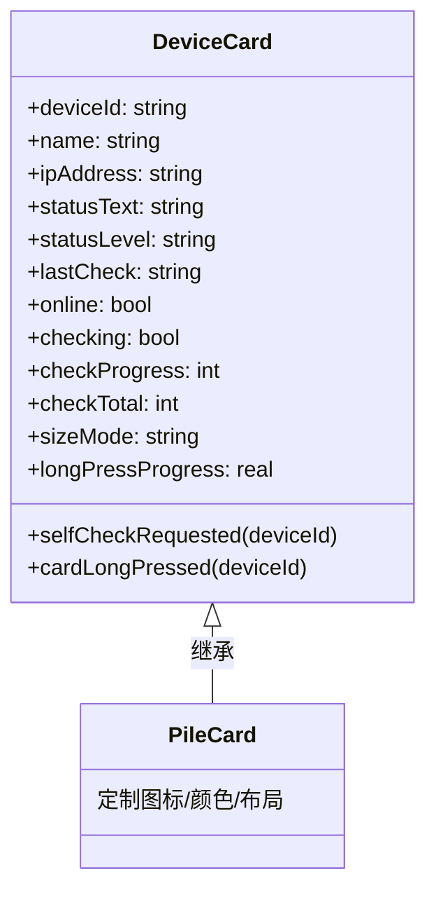

# DeviceCard + PileCard 重构

## 设计方案

## 接口设计

**DeviceCard 完整属性**：

- `deviceId`: 设备ID
- `name`: 设备名称
- `ipAddress`: IP地址
- `statusText`: 状态文本
- `statusLevel`: 状态级别 (`"normal"` / `"warning"` / `"error"`)
- `lastCheck`: 最后检测时间
- `online`: 在线状态
- `checking`: 是否正在自检
- `checkProgress` / `checkTotal`: 自检进度
- `sizeMode`: 尺寸模式 `"compact"` (280×180) / `"standard"` (360×240) / `"large"` (440×300)
- `longPressProgress`: 长按进度（内部状态）

**DeviceCard 信号**：

- `selfCheckRequested(deviceId)`
- `cardLongPressed(deviceId)`

**PileCard 定制内容**（无新属性）：

- 充电桩图标 (`\uE1E0` ev_station)
- 充电桩配色（绿色渐变头部）
- 充电桩专用布局样式

**移除的属性**：

- `deviceType`: 由具体子组件类型决定
- `location`: 统一用 `ipAddress`

## 修改内容

### 1. [qml/card/DeviceCard.qml](qml/card/DeviceCard.qml)

- 添加 `ipAddress`, `checkProgress`, `checkTotal`, `sizeMode`, `longPressProgress` 属性
- 添加 `cardLongPressed` 信号
- 添加长按手势检测 + 进度计时器 + 重置动画
- 添加长按进度边框效果
- 根据 `sizeMode` 计算 `implicitWidth` / `implicitHeight`
- 移除 `deviceType`, `location` 属性
- 重新设计为可被继承的基础布局（抽象化图标/颜色/头部区域）

### 2. [qml/card/PileCard.qml](qml/card/PileCard.qml)

- 改为继承 DeviceCard（移除所有重复代码）
- 仅保留充电桩专用的视觉定制：
  - 图标定义
  - 颜色/渐变定义
  - 布局微调（如有需要）

### 3. [qml/page/Home.qml](qml/page/Home.qml)

- 检查并更新 PileCard 的使用方式（如有需要）