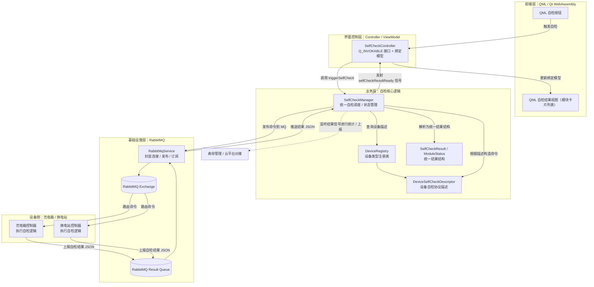

**QML ↔ C++ ↔ RabbitMQ** 的业务架构，尽量通用、可复用。

---

## 1. 总体分层：一套 C++ 后端，被多种 QML 页面复用

可以先定三层，但都在一个进程里：

1. **设备无关层（核心服务）**
    
    - `RabbitMqService`：统一负责和 RabbitMQ 通信。
        
    - `SelfCheckManager`：统一负责“自检请求 + 结果汇总 + 状态管理”，不关心具体是充电箱还是换电站。
        
2. **设备类型描述层（可配置的设备定义）**
    
    - `DeviceSelfCheckDescriptor`：描述某一类设备的自检协议和展示维度。
        
    - `DeviceRegistry`：注册“充电箱”、“换电站”等不同设备类型的 Descriptor。
        
3. **界面控制层（面向 QML 的 Controller / ViewModel）**
    
    - `SelfCheckController`（`QObject`）：暴露给 QML 的接口。
        
    - 维护一个/多个可绑定的 Model（比如“最近一次自检结果”列表），驱动 QML 卡片。
        

关键点：  
**自检业务逻辑只写一次在 SelfCheckManager 里**，新设备类型只需要多加一份 Descriptor，不新开一套流程。

---

## 2. 核心领域模型：统一状态结构

无论是充电箱、自检站，还是以后新增设备，结果统一抽象成三层信息：

1. **整体结果**
    
    - `deviceType`：charger_box / swap_station / ...
        
    - `deviceId`：设备编号。
        
    - `requestId`：本次自检唯一 ID（发起时生成）。
        
    - `overallStatus`：ok / warn / error / unknown。
        
    - `timestamp`：结果时间。
        
2. **子模块状态（对应 UI 上的卡片）**
    
    - `moduleName`：communication / main_control / power / gun_head / safety...
        
    - `status`：ok / warn / error / unknown。
        
    - `code`：状态码，比如 COMM_OK / MCU_TEMP_HIGH。
        
    - `message`：人类可读的描述。
        
    - `timestamp`：该模块结果时间。
        
    - `details`：扩展字段，用于展示详情弹窗或 tooltip，比如温度、电压等 key-value。
        
3. **扩展字段**
    
    - 保留一个“原始 JSON”或“附加属性”的容器，未来需要展示更多信息时不用改类结构。
        

**设计原则：**

- QML 展示只依赖这套标准结构，不看 MQ 原始 JSON。
    
- 解析从“具体设备协议 JSON” → “统一结构”的逻辑由 Descriptor 层负责，Manager 只负责调度。
    

---

## 3. RabbitMQ 适配层设计

### 3.1 角色：RabbitMqService（统一对 MQ 的封装）

职责：

- 维护一个 MQ 连接和若干 Channel。
    
- 提供简单接口：
    
    - `publish(exchange, routingKey, jsonPayload)`
        
    - `subscribe(queue, callback(jsonPayload))`
        
- 处理重连、心跳、线程切换（必要时回到 Qt 主线程）。
    

目标：  
**业务层不关心 amqpcpp / libevent / 线程细节**，只接受/发送 JSON 结构化数据。

### 3.2 消息形态（协议层面）

命令消息建议统一这样（概念上）：

- 下行（发送给设备）：
    
    - `msg_type = "self_check_cmd"`
        
    - `device_type`
        
    - `device_id`
        
    - `check_type`（full / quick / partial）
        
    - `request_id`
        
    - `timestamp`
        
    - `extra`（可选）
        
- 上行（设备上报结果）：
    
    - `msg_type = "self_check_result"`
        
    - `device_type`
        
    - `device_id`
        
    - `request_id`
        
    - `overall_status`
        
    - `timestamp`
        
    - `modules`：数组，每个模块包含 status/code/message/timestamp/details。
        

这样 SelfCheckManager 的逻辑可以完全设备无关，只根据 Descriptor 来“解释”这些字段。

---

## 4. SelfCheckManager：统一的自检业务中枢

### 4.1 职责

- 对外提供“发起自检”的接口：
    
    - 输入：设备类型（模块名）、设备 ID、自检类型（full/quick）。
        
    - 输出：`requestId`。
        
- 负责：
    
    - 根据设备类型，找到对应 Descriptor。
        
    - 构造命令 payload（调用 Descriptor 提供的构造器）。
        
    - 通过 RabbitMqService 发布到对应 exchange/routingKey。
        
- 订阅各设备结果队列：
    
    - RabbitMqService 收到 JSON 后回调到 SelfCheckManager。
        
    - SelfCheckManager 根据 Descriptor 解析为统一的 `SelfCheckResult`。
        
    - 更新缓存（最近一次结果）。
        
    - 发 Qt signal 通知上层（Controller/QML）。
        

### 4.2 状态/缓存管理

SelfCheckManager 可以维护一些内部状态：

- `latestResult[deviceType, deviceId]`：最近一次完整结果。
    
- `ongoingChecks[requestId]`（可选）：发起时间、设备 ID、自检类型，用于超时处理、统计分析。
    
- 未来可扩展：
    
    - 自检历史列表（用于日志页面）。
        
    - 统计信息（最近 N 次通过率、平均耗时等）。
        

---

## 5. 设备类型描述层：DeviceSelfCheckDescriptor

为了做到“新增设备类型，只写一个配置，而不是一套类”，这层建议设计成**数据+函数的组合**：

### 5.1 核心内容

每类设备的 Descriptor 需要描述：

1. **RabbitMQ 相关**
    
    - `name`（内部模块名，例如 "charger_box"）
        
    - `deviceType`（协议字段值，例如 "charger_box"）
        
    - `cmdExchange`
        
    - `cmdRoutingKey`
        
    - `resultQueue`
        
2. **命令构造逻辑**
    
    - 给定一份“标准命令基础字段”（deviceId/checkType/requestId/timestamp），如何拼成设备侧需要的 JSON。
        
    - 例如对某设备多加 `extra` 字段，或者字段名略有差异。
        
3. **结果解析逻辑**
    
    - 给定设备上报的 JSON，如何提取：
        
        - overallStatus
            
        - modules 数组（名称、状态、code、message、timestamp、details）。
            
    - 状态码映射（比如设备发的是 0/1/2，要映射为 ok/warn/error）。
        

### 5.2 设备类型注册

设计一个 `DeviceRegistry`：

- 启动时注册：
    
    - `registerDescriptor("charger_box", ChargerBoxDescriptor)`
        
    - `registerDescriptor("swap_station", SwapStationDescriptor)`
        
- SelfCheckManager 只认 `moduleName`（比如 "charger_box"），通过 Registry 拿对应 Descriptor。
    

这样换电站接入时，主要工作量是：

- 定义好 MQ 策略（交换机/队列/routingKey）。
    
- 写一个“命令构造”和“结果解析”的配置/函数。
    
- UI 层几乎不用改。
    

---

## 6. 界面控制层：SelfCheckController / ViewModel

考虑 WebAssembly 与桌面都用 QML，这一层就要专门为 QML 服务。

### 6.1 角色：SelfCheckController（QObject）

职责：

- 对 QML 暴露：
    
    - `triggerSelfCheck(deviceType, deviceId, checkType)` → 返回 requestId。
        
    - `getLatestResult(deviceType, deviceId)`。
        
- 监听 SelfCheckManager 的 signal：
    
    - 收到 `SelfCheckResult` 后，更新内部 Model 或直接发 signal 给 QML。
        

### 6.2 数据绑定方式

可以提供几种方式给 QML：

1. **最近一次结果（单设备）**
    
    - Controller 保持一个 `currentResult`（按当前选中设备）。
        
    - QML 绑定这个结果的属性/子模型绘制卡片。
        
2. **列表模型**
    
    - 提供一个 `SelfCheckResultModel` 或 `ModuleStatusModel`。
        
    - QML 用 `Repeater` / `ListView` / `GridView` 去画每一个子模块卡片。
        
    - 这样 UI 完全不关心设备类型，只关心数据结构：module name + status + message + timestamp。
        
3. **状态信号**
    
    - 例如 `onSelfCheckStarted(requestId, deviceId)`，让前端显示“运行中”的 spinner。
        
    - `onSelfCheckResultReady(result)`，前端更新视图。
        

重点：**QML 页面只写一套**，通过数据驱动：

- “充电箱自检页” 和 “换电站自检页” 可以共用同一套 Module 卡片组件，只是模块名不同（来自结果模块的 name 字段或 Descriptor 的 UI 配置）。
    

---

## 7. 触发流程的完整链路（时序视角）

以“WebAssembly 端点击充电箱自检”举例：

1. 用户在浏览器中点击 QML 按钮：“对 CHG-001 充电箱进行自检”。
    
2. QML 调用 `SelfCheckController.triggerSelfCheck("charger_box", "CHG-001", "full")`。
    
3. SelfCheckController 转发给 SelfCheckManager。
    
4. SelfCheckManager：
    
    - 通过 DeviceRegistry 找到 ChargerBoxDescriptor。
        
    - 生成 `requestId`。
        
    - 组装通用命令基础字段。
        
    - 调用 Descriptor 的命令构造函数 → 得到设备协议 JSON。
        
    - 调用 RabbitMqService.publish(exchange, routingKey, payload)。
        
    - 发出 `selfCheckStarted` 信号。
        
5. UI 收到 `selfCheckStarted`：
    
    - 显示本设备“自检中”的状态。
        
6. 设备执行自检后，将结果上报到预先约定的队列。
    
7. RabbitMqService 订阅队列，收到 JSON 消息，回调给 SelfCheckManager。
    
8. SelfCheckManager：
    
    - 调用 Descriptor 的结果解析逻辑 → 得到统一的 `SelfCheckResult`。
        
    - 更新内部缓存 latestResult[deviceType, deviceId]。
        
    - 发出 `selfCheckResultReady(result)`。
        
9. SelfCheckController 收到 signal：
    
    - 更新 QML model / 属性。
        
10. QML UI 自动刷新：每个模块卡片显示本次结果 / 时间戳 / 状态颜色。
    

整条链路里，**Web/桌面在架构层面没有区别**，只是同一套 QML 运行在不同宿主（桌面 Qt / WASM）。

---

## 8. 扩展性与代码量控制

设计目标是：**新增一种设备类型，不增加“流程类”，只增加配置与解析逻辑**。

理想情况下，新增“换电站自检”，只需要做：

1. MQ 层已有 RabbitMqService，不动。
    
2. SelfCheckManager 不动。
    
3. 新增一个 `SwapStationDescriptor`，填好：
    
    - 交换机 / routingKey / 队列。
        
    - 命令 JSON 组装方式。
        
    - 结果 JSON → 统一结构的解析。
        
4. 在启动时 `DeviceRegistry.register("swap_station", SwapStationDescriptor)`。
    
5. QML 页面：
    
    - 如果 UI 风格一样，可以复用同一套组件，只是调用 `triggerSelfCheck("swap_station", stationId)`。
        
    - 如果需要额外信息（比如机械结构详情），通过 `details` 字段在 UI 中抽出来展示即可。
        

这样可以把未来的“寿命管理、其它设备的自检”等都挂在同一套体系下，SelfCheckManager 成为“所有自检的中枢”，而你主要在“描述设备”和“设计 UI 视图”上做增量工作。

---

# E-AutoCheck 自检子系统架构图

> 视角：围绕“充电箱/换电站自检”这一条业务链，从 QML 按钮到 RabbitMQ，再回到 UI 展示。

